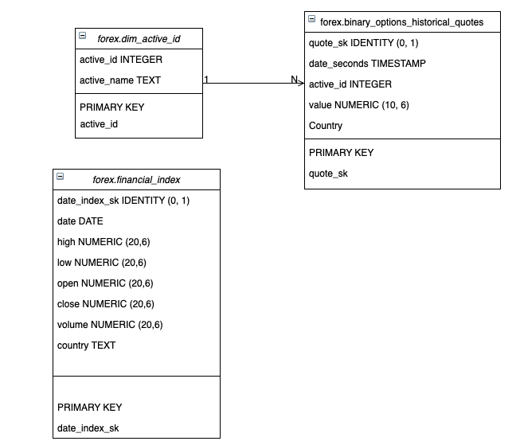

# FOREX data pipeline

This project consists of a data pipeline that extracts FOREX data from iqoption api and stores it into Amazon Redshift for further predictive analysis.


## Pipeline overview


We use parallel computing to extract data from API and we partition this data and store it on S3, as it is a cheap option to store raw data.

After that, as the data is partitioned in numerous files, we use pyspark to clean and transform the data and load it back to S3. We could load it directly to Redshift using JDBC protocol. But, spark's JDBC protocol is very slow and it would take an enormous amount of time to load.

So, we load it back to S3 and COPY from there to Redshift.

Once the COPY is completed, we run data quality checks to make certain everything ran smoothly.

## Dimensional model

As we are interested in developing a timeseries prediction over the historical data for each currency pair, there's no need for a complex dimensional model. So, to keep things simple, our model is as follows:


### forex.dim_active_id
- **active_id INTEGER:** currency pair id
- **active_name TEXT:** currency pair name

### forex.binary_options_historical_quotes**
- **quote_sk IDENTITY (0,1):** unique identifier
- **date_seconds TIMESTAMP:** date in seconds
- **active_id INTEGER:** currency pair id
- **value NUMERICAL (10, 6):** currency pair market value

## Requirements

In order to run this pipeline, you need to set up an IAM role that have read/write permissions on both Amazon's S3 and Amazon's Redshift. You'll also need to create an S3 bucket and a Redshift cluster.

Besides that, you'll need to install Docker, as we'll need it to run transformations in Spark.

All the packages used in this project are listed in [**requirements.txt**](https://gitlab.com/projetos-di/valor-do-evento/blob/master/csv_handler/README.md). Just run `pip install requirements` and you'll be all set!


## How to run

First things first, you need to insert your AWS credentials where applicable e.g: `connect_postgres.py`, `spark.py`, `remove_s3_files.py`,  `functions.py` and set up your connections info on Airflow's web UI, such as your IAM credentials and Amazon Redshift credentials.

Then, you'll need to start an Airflow's webserver from home directory in terminal:

```
export AIRFLOW_HOME="$(pwd)"
airflow webserver --port 8080 -D
```

After that, you have to start Airflow's scheduler. To do that, run the following on your terminal:
```
airflow scheduler
```

Once both server and scheduler are booted, all you need to do is go to Airflow's UI (http://localhost:8080) and activate the dag. The process is configured to run daily, but you can change that to your needs.

## Folder structure
Folder name | Description
----------------|--------------------
**csvs** | Intermediate csv files created throughout each pipeline run.
**dags** | Airflow's dag scripts
**jars** | Jar files used to configure spark.
**logs** | Airflow's logs
**plugins** | Airflow's custom operators
**scripts** | ETL python scripts
