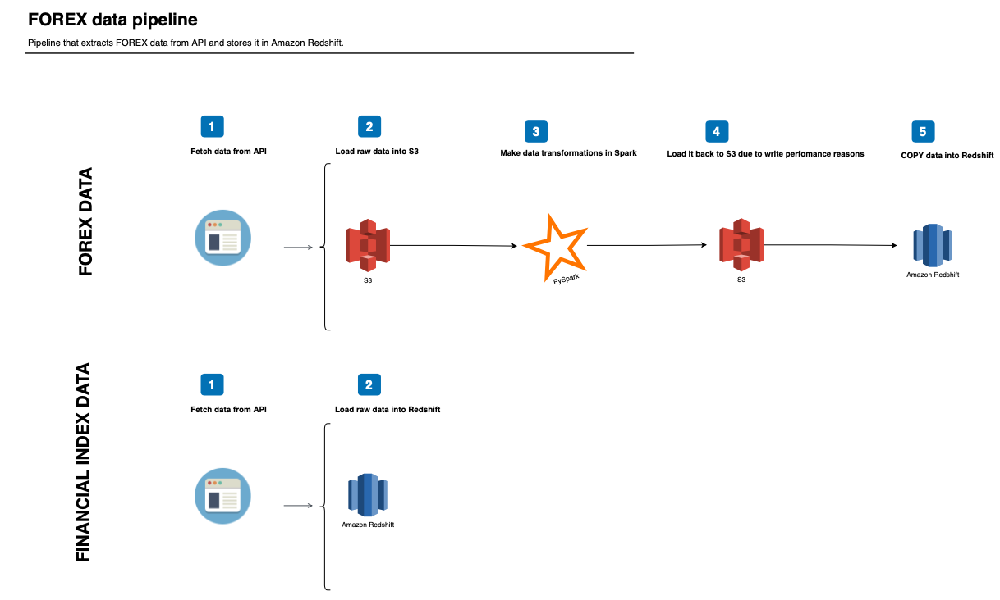

# FOREX data pipeline

This project consists of a data pipeline that extracts FOREX data from iqoption api and stores it into Amazon Redshift for further predictive analysis and also extracts financial indexes from each country of the selected currency pairs in order to generate features for model tuning.

The objective is to develop binary predictive models in each currency pair. The financial index data will be used as a possible set of features that can help to build the predictive model.

## Pipeline overview




The data pipeline is comprised of 2 data sources:

- FOREX DATA
- FINANCIAL INDEX DATA

### FOREX DATA

We use parallel computing to extract data from API and we partition this data and store it on S3, as it is a cheap option to store raw data.

After that, as the data is partitioned in numerous files, we use pyspark to clean and transform the data and load it back to S3. We could load it directly to Redshift using JDBC protocol. But, spark's JDBC protocol is very slow and it would take an enormous amount of time to load.

So, we load it back to S3 and COPY from there to Redshift.

Once the COPY is completed, we run data quality checks to make certain everything ran smoothly.

### FINANCIAL INDEX DATA

We use the `yfinancial` package in tandem with `pandas_datareader` to download each index data from the selected period. After that, we insert the data directly into redshift.

## Dimensional model

As we are interested in developing a binary prediction over the historical data for each currency pair, there's no need for a complex dimensional model. So, to keep things simple, our model is as follows:


The financial index table is not linked to any table in this model due to it's daily granularity. The idea is to use this data as a set of auxiliary data to generate features when building the predictive model (e.g: does the relationship of USD/EUR financial index on D-1 affect the EUR/USD currency pair on D-0?)

### forex.dim_active_id
- **active_id INTEGER:** currency pair id
- **active_name TEXT:** currency pair name

### forex.binary_options_historical_quotes
- **quote_sk IDENTITY (0,1):** unique identifier
- **date_seconds TIMESTAMP:** date in seconds
- **active_id INTEGER:** currency pair id
- **value NUMERICAL (10, 6):** currency pair market value

### forex.financial_index
- **date_index_sk IDENTITY (0,1)**:
- **date DATE**: date of the operation
- **high NUMERICAL (20,6)**: max index value at that day
- **low NUMERICAL (20,6)**: min index value at that day
- **open NUMERICAL (20,6)**: index value at the time of the market opened
- **close NUMERICAL (20,6)**: index value at the time of the market closed
- **volume NUMERICAL (20,6)**: transaction volume for each index at each day   
- **country TEXT**: Index's country

## Requirements

In order to run this pipeline, you need to set up an IAM role with read/write permissions on both Amazon's S3 and Amazon's Redshift. You'll also need to create an S3 bucket and a Redshift cluster.

Besides that, you'll need to install Docker, as we'll use it to run transformations in Spark.

All the packages used in this project are listed in [**requirements.txt**](https://github.com/rapha-carvalho/forex_data/blob/main/requirements.txt). Just run `pip install requirements` and you'll be all set!

You’ll also need to download the following jar files and place them into /jars folder:

- [hadoop-aws 3.2.0](https://mvnrepository.com/artifact/org.apache.hadoop/hadoop-aws/3.2.0)
- [aws-java-sdk-bundle 1.11.1015](https://mvnrepository.com/artifact/com.amazonaws/aws-java-sdk-bundle/1.11.1015)
- [redshift-jdbc42 2.0.0.4](https://mvnrepository.com/artifact/com.amazon.redshift/redshift-jdbc42/2.0.0.4)

You'll also need to install Apache Airflow (the project was developed on version 2.0.2) and the following providers:

- apache-airflow-providers-postgres
- apache-airflow-providers-amazon


## How to run

First things first, you need to insert your AWS credentials where applicable e.g: `connect_postgres.py`, `spark.py`, `remove_s3_files.py`,  `functions.py` and set up your connections info on Airflow's web UI, such as your IAM credentials (name it: aws_credentials) and Amazon Redshift credentials (name it: redshift).


Then, you should start Airflow's db and create an user with an Admin role.

```
export AIRFLOW_HOME="$(pwd)"

airflow db init


airflow users create \
    --username admin \
    --firstname john \
    --lastname doe \
    --role Admin \
    --email john.doe@gmail.com
```

After that, you'll need to start an Airflow's webserver from home directory in terminal:

```
airflow webserver --port 8080 -D
```

Finally, you have to start Airflow's scheduler. To do that, run the following on your terminal:
```
airflow scheduler
```

Once both server and scheduler are booted, all you need to do is go to Airflow's UI (http://localhost:8080) and activate the dag. The process is configured to run daily, but you can change that to your needs.

## Folder structure
Folder name | Description
----------------|--------------------
**dags** | Airflow's dag scripts
**jars** | Jar files used to configure spark.
**logs** | Airflow's logs
**plugins** | Airflow's custom operators
**scripts** | ETL python scripts
**scripts/csvs** | Intermediate csv files created throughout each pipeline run.


## Scenarios


**What if the data volume was increased by 100x?**

The pipeline was designed to fetch data through parallel processing. So, in case the data would increase by 100x, we can easily scale the pipeline through addition of more threads and more computing power through spark cluster.

The bottleneck would be the spark cluster, which is running locally on the current configuration. The alternative would be to use Amazon EMR instead of local mode.

**What if the pipelines were run on a daily basis by 7am?**

The pipeline is already configured to run on a daily basis, but could be easily configure to run on different schedules based on your need. You just need to change the dag schedule.

**What if the database needed to be accessed by 100+ people?**

All the final data is stored in Amazon Redshift, so it could be easily accessible to 100+ people.
